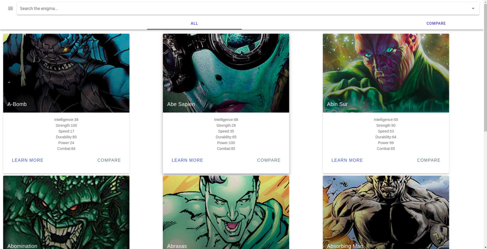
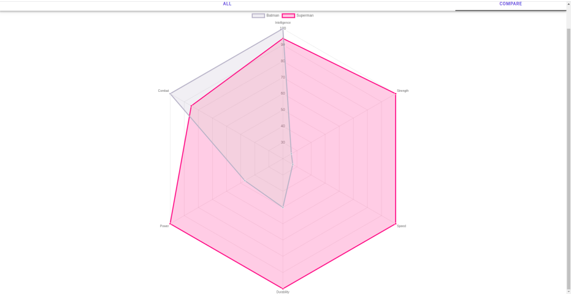
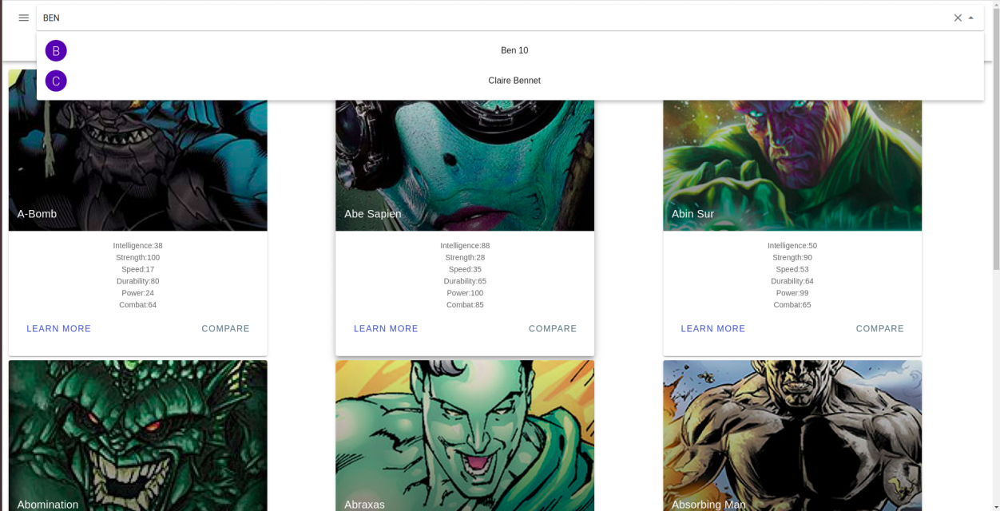

# SupHero

SupHero is an api based superhero information web app which allows the grapical comparison of the characters of various fictional universes.

Charts


Search specific heros


## Project setup
```
npm install
```

### Compiles and hot-reloads for development
```
npm run serve
```

### Compiles and minifies for production
```
npm run build
```

### Lints and fixes files
```
npm run lint
```

### Customize configuration
See [Configuration Reference](https://cli.vuejs.org/config/).

